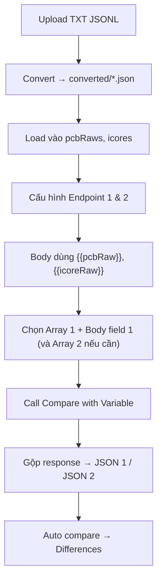

# Hướng dẫn sử dụng API Compare

Tài liệu này mô tả cách dùng tab **API Compare** trong công cụ JSON Compare (`/json-compare`).

## Mục đích

API Compare giúp bạn:

1. Gọi **2 API** (Endpoint 1 và Endpoint 2) với cùng cấu hình request
2. Lấy response, tự động gộp kết quả (khi chạy batch)
3. **So sánh (diff)** JSON giữa hai phía và xem field nào khác

Phù hợp khi cần regression test giữa 2 môi trường, 2 version API, hoặc so sánh output từ nhiều bản ghi input (vd. hàng trăm / hàng nghìn `pcbRaw`).

---

## Tổng quan giao diện

Tab **API Compare** gồm các khối theo thứ tự từ trên xuống:

| Khối                           | Chức năng                                                |
| ------------------------------ | -------------------------------------------------------- |
| **TXT → JSON Converter**       | Convert file TXT (JSONL) thành JSON array, load vào biến |
| **Variables**                  | Khai báo biến dùng trong URL / Headers / Body            |
| **Endpoint 1 & 2**             | Cấu hình method, URL, headers, body cho 2 API            |
| **Call Compare with Variable** | Chạy batch: loop theo array 1, inject 1–2 field body → gọi 2 API |
| **JSON 1 / JSON 2**            | Hiển thị response đã gộp (pretty-print)                  |
| **Compare options**            | Tuỳ chọn quy tắc so sánh                                 |
| **Differences**                | Bảng diff (Flat) hoặc cây (Tree)                         |

> **Lưu ý:** Tab **Manual Compare** và **API Compare** dùng **workspace riêng**. Gọi API chỉ cập nhật JSON ở tab API, không ảnh hưởng tab Manual.

---

## Quy trình chuẩn (ví dụ `pcbRaws` + `icores`)



### Bước 1 — Chuẩn bị dữ liệu input

1. Vào tab **API Compare**
2. Ở **Variables**, thêm biến array (vd. `pcbRaws`, `icores` — value để trống tạm)
3. Ở **TXT → JSON Converter**:
   - **Upload TXT**: mỗi dòng file là 1 JSON object
   - File convert xong lưu vào thư mục `converted/` (vd. `pcb.json`, `icore.json`)
4. Với **mỗi** file convert:
   - Chọn **Converted file** → chọn **Variable key** tương ứng → bấm **Load to variable**

Sau bước này mỗi biến có dạng JSON array: `[{...}, {...}, ...]`.

**Gợi ý đặt tên:** array số nhiều (`pcbRaws`, `icores`) → field body số ít (`pcbRaw`, `icoreRaw`). Tool tự gợi ý body field khi tên array kết thúc bằng `s`.

### Bước 2 — Cấu hình Endpoint

Mỗi endpoint có:

| Trường             | Mô tả                             |
| ------------------ | --------------------------------- |
| **Method**         | GET, POST, PUT, PATCH, DELETE     |
| **URL**            | URL đầy đủ, hỗ trợ `{{tên_biến}}` |
| **Headers (JSON)** | Object JSON, hỗ trợ biến          |
| **Body (JSON)**    | Chỉ hiện với POST / PUT / PATCH   |

**Body gợi ý (1 field):**

```json
{
  "pcbRaw": "{{pcbRaw}}"
}
```

**Body gợi ý (2 field — dùng cùng lúc `pcbRaws` + `icores`):**

```json
{
  "data": {
    "pcbRaw": "{{pcbRaw}}",
    "internalFacilitiesRaw": "{{icoreRaw}}",
    "declaredIncome": 20000000,
    "productType": "REVI_CREDIT",
    "productCode": "REVI_CREDIT_OCTO_APP"
  }
}
```

- Mỗi `{{tên_biến}}` được thay bằng **chuỗi JSON** (string) khi gửi request
- Giá trị inject luôn được escape đúng chuẩn JSON string

**Preview:** Nếu body/URL có `{{...}}`, dưới ô nhập sẽ hiện **Resolved preview** để kiểm tra trước khi gọi.

### Bước 3 — Gọi API và so sánh

Có **2 cách** gọi:

#### A. Call Both & Compare (đơn giản)

- Gọi **1 lần** Endpoint 1 và Endpoint 2 với biến hiện tại
- Nếu có biến array (value bắt đầu bằng `[`), tool tự loop theo biến ưu tiên (`jsArray` → `pcbRaw` → biến được reference trong body)

#### B. Call Compare with Variable (khuyến nghị cho batch)

Khối **Call Compare with Variable** có **2 cặp** array → body field:

| Ô chọn | Bắt buộc | Vai trò |
| ------ | -------- | ------- |
| **Array 1 (vòng lặp)** | Có | Biến array quyết định **số lần gọi API** |
| **Body field 1** | Có | Field inject phần tử `array1[i]` (vd. `pcbRaw` ↔ `{{pcbRaw}}`) |
| **Array 2 (cùng index, tùy chọn)** | Không | Biến array thứ hai, inject `array2[i]` nếu còn phần tử |
| **Body field 2 (tùy chọn)** | Khi có Array 2 | Field inject phần tử array 2 (vd. `icoreRaw` ↔ `{{icoreRaw}}`) |

**Cách chọn nhanh:**

1. Thêm ít nhất 1 biến array trong **Variables** (value bắt đầu bằng `[`)
2. Tool **tự gợi ý** Array 1 = array đầu tiên trong list, Array 2 = array thứ hai (nếu có)
3. Body field gợi ý theo tên: `pcbRaws` → `pcbRaw`, `icores` → `icore` (bỏ `s` cuối)
4. Kiểm tra / chỉnh lại dropdown nếu tên biến khác convention
5. Bấm **Call Compare with Variable**

**Logic vòng lặp (quan trọng):**

- Số lần gọi = **độ dài Array 1** (không phụ thuộc Array 2)
- Mỗi lần lặp index `i`:
  - Luôn inject `array1[i]` → Body field 1
  - Nếu có Array 2 **và** `i < độ_dài_array2` → inject `array2[i]` → Body field 2
  - Nếu `i` vượt quá độ dài Array 2 → **bỏ qua** inject array 2 (không báo lỗi)
- Gọi song song Endpoint 1 và Endpoint 2
- Chỉ batch **cả 2 API đều thành công** mới được đưa vào JSON gộp

**Ví dụ:** `pcbRaws` có 213 phần tử, `icores` có 124 phần tử, Array 1 = `pcbRaws`:

| Index `i` | Inject |
| --------- | ------ |
| `0` … `123` | `pcbRaws[i]` → `pcbRaw` **và** `icores[i]` → `icoreRaw` |
| `124` … `212` | Chỉ `pcbRaws[i]` → `pcbRaw` |

Ngược lại, nếu Array 1 = `icores` (124 phần tử) → chạy **124 lần**, dùng `pcbRaws[0..123]` khi có Array 2 = `pcbRaws`.

**Chỉ 1 array:** để **Array 2** = `None`, chỉ cần Array 1 + Body field 1.

Sau khi chạy xong, tool tự **load JSON 1 / JSON 2** và **chạy compare**.

---

## Biến (Variables)

### Cú pháp

Dùng cú pháp Postman: `{{tên_biến}}` trong URL, Headers, Body.

### Kiểu giá trị

| Loại           | Ví dụ value              | Ghi chú                 |
| -------------- | ------------------------ | ----------------------- |
| Chuỗi thường   | `abc`                    | Dùng trực tiếp          |
| Chuỗi JSON     | `"hello"`                | Tự unwrap thành `hello` |
| Object / Array | `{"a":1}` hoặc `[{...}]` | Lưu dạng JSON           |

### Import / Export

- **Import JSON**: file dạng `{ "key": "value", ... }`
- **Export**: tải `variables.json`
- Cấu hình **variables, endpoints, arrayCompare** được **lưu tự động** trên browser (local)

---

## Xử lý response API

Sau mỗi lần gọi, tool xử lý body như sau:

1. Parse JSON response
2. Nếu có key `data` ở root → chỉ lấy nội dung `data` (pretty-print)
3. Nếu không → lấy toàn bộ response (pretty-print)

Khi chạy **batch**, các response thành công được **gộp thành 1 JSON array** rồi hiển thị ở JSON 1 / JSON 2.

---

## Xem kết quả so sánh

### Summary banner

Hiện tổng số diff: missing field, type mismatch, value mismatch.

### Differences — Flat

Bảng danh sách với cột: Type, Path, JSON 1, JSON 2. Có filter, sort, phân trang (100 dòng/trang).

### Differences — Tree

Cây path lồng nhau, ví dụ:

```
[7]  $[7]
  loans  $[7].loans
    [0]  $[7].loans[0]
      outstanding  $[7].loans[0].outstanding
```

Mỗi leaf hiển thị:

- **Tên field** bị sai
- **Full path**
- Loại lỗi + nhãn _Thiếu JSON 1 / Thiếu JSON 2 / Khác giá trị_
- Giá trị JSON 1 và JSON 2

### Click vào 1 diff

- Scroll tới dòng tương ứng trong **JSON 1** và **JSON 2**
- Highlight dòng đó (màu theo loại diff)
- Header editor hiện loại lỗi

### Export

- **Copy** (icon clipboard): copy toàn bộ diff dạng JSON
- **Download CSV**: tải `json-diff.csv`

---

## Tuỳ chọn so sánh (Compare options)

| Option                       | Ý nghĩa                                     |
| ---------------------------- | ------------------------------------------- |
| **Slice Equals** + số chữ số | So sánh số sau khi cắt phần thập phân       |
| **Number equal**             | `1` và `1.0` coi là bằng nhau               |
| **Trim string**              | Bỏ khoảng trắng đầu/cuối chuỗi trước khi so |
| **Missing = null**           | Field thiếu và `null` coi là bằng           |
| **String/Num equal**         | `"123"` và `123` coi là bằng                |
| **Key Ignore Case**          | Tên key object không phân biệt hoa thường   |

> Array được so theo **index** (`[0]`, `[1]`, …), không so theo thứ tự key trong object.

---

## Batch thất bại (Failed batches)

Khi chạy batch, nếu một hoặc cả hai API lỗi:

- Batch đó **không** đưa vào JSON gộp
- Thông tin lỗi lưu vào panel **Failed batches**
- File server: `failed/batch-failures.json` (có thể download từ UI)

Mỗi lỗi gồm: batch index, endpoint (EP1/EP2), HTTP status, message, snippet response.

---

## Mẹo & xử lý lỗi thường gặp

### Không thấy biến trong dropdown Array

- Value của biến phải là **JSON array hợp lệ**, bắt đầu bằng `[`

### Nút "Call Compare with Variable" bị disable

- Chọn đủ **Array 1** và **Body field 1**
- Array 1 phải là biến array hợp lệ trong **Variables**
- Nếu chọn Array 2 thì phải chọn thêm **Body field 2**
- Body Endpoint 1 nên có `{{tên_field}}` tương ứng để preview đúng

### Hai array khác độ dài

- **Không lỗi** — vòng lặp luôn theo Array 1
- Array 2 chỉ inject khi index `i` còn trong phạm vi; các index sau giữ nguyên giá trị biến cũ trong body

### Response rỗng / compare lỗi

- Kiểm tra URL, headers, body đã resolve đúng chưa (xem preview)
- Xem **Failed batches** nếu chạy batch
- Đảm bảo API trả JSON hợp lệ

### JSON quá lớn (lite mode)

- Editor tự chuyển **lite mode** khi > 400 dòng
- Vẫn scroll, highlight dòng active khi click diff
- Diff table có phân trang

### Path trong editor không khớp diff

- Response gộp là **array ở root** → path dạng `$[0].field`, `$[1].loans[0].outstanding`
- Nếu JSON không có wrapper `data` nhưng diff path có `$.data...`, tool tự chuẩn hoá path khi tìm dòng

---

## Workflow nhanh (checklist)

### Một array (`pcbRaws` only)

- [ ] Thêm biến `pcbRaws`
- [ ] Upload TXT → Convert → Load vào `pcbRaws`
- [ ] Cấu hình Endpoint 1 & 2 (body có `{{pcbRaw}}`)
- [ ] Array 1 = `pcbRaws`, Body field 1 = `pcbRaw`, Array 2 = `None`
- [ ] **Call Compare with Variable**

### Hai array (`pcbRaws` + `icores`)

- [ ] Thêm biến `pcbRaws` và `icores` (thứ tự trong Variables quan trọng cho gợi ý tự động)
- [ ] Convert & load từng file TXT vào đúng biến
- [ ] Cấu hình body có `{{pcbRaw}}` và `{{icoreRaw}}` (hoặc tên field bạn dùng)
- [ ] Array 1 = `pcbRaws` (vòng lặp), Body field 1 = `pcbRaw`
- [ ] Array 2 = `icores`, Body field 2 = `icoreRaw`
- [ ] **Call Compare with Variable**
- [ ] Xem summary + mở **Tree** để duyệt diff
- [ ] Click từng diff để nhảy tới field trong JSON 1 / JSON 2
- [ ] Export CSV nếu cần báo cáo

---

## Kiến trúc kỹ thuật (tham khảo)

| Thành phần                    | Mô tả                          |
| ----------------------------- | ------------------------------ |
| `POST /api/json-compare/call` | Proxy gọi API (tránh CORS)     |
| `POST /api/json-compare/temp` | Lưu response tạm (single call) |
| `converted/`                  | File JSON đã convert từ TXT    |
| `failed/batch-failures.json`  | Log batch lỗi                  |
| `arrayCompare` (localStorage) | Cấu hình Array 1/2 + Body field 1/2 |

Request gửi qua proxy gồm: `method`, `url`, `headers`, `body` (đã resolve biến).

**Cấu hình `arrayCompare` lưu trên browser:**

```json
{
  "sourceVariable": "pcbRaws",
  "injectVariable": "pcbRaw",
  "secondarySourceVariable": "icores",
  "secondaryInjectVariable": "icoreRaw"
}
```

- `sourceVariable` / `injectVariable`: cặp array → body field chính (vòng lặp)
- `secondarySourceVariable` / `secondaryInjectVariable`: cặp thứ hai (tuỳ chọn, cùng index)

---

## Liên hệ / mở rộng

- Tab **Manual Compare**: dán JSON trực tiếp, không cần gọi API
- Cùng bộ **Compare options** dùng chung cho cả Manual và API tab

Nếu cần thêm case sử dụng hoặc ảnh minh hoạ, bổ sung vào file này hoặc tạo issue nội bộ.
